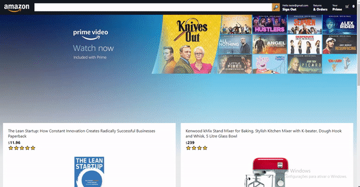

<h1 align="center">
  Amazon Clone
</h1>

<h1 align="center">
  
</h1>

---

## 🚀 Technologies

This project was developed at the Clever Programmer with the following technologies:

- [ReactJS](https://reactjs.org)
- [Firebase](https://firebase.google.com/docs)
- [Stripe](https://stripe.com/docs/api)
- [Axios](https://github.com/axios/axios)
- [Moment](https://momentjs.com)
- [VS Code](https://code.visualstudio.com/) with [EditorConfig](https://marketplace.visualstudio.com/items?itemName=EditorConfig.EditorConfig) and [ESLint](https://marketplace.visualstudio.com/items?itemName=dbaeumer.vscode-eslint)

---

## ⚙️ How To Use

```bash

  # Clone this repository
  $ git clone https://github.com/willianPetri/Amazon-clone.git

  # Go into the repository
  $ cd Amazon-clone

  # Install dependecies
  $ npm install

  #Run the project
  $ npm start
```

---

Made with ❤ by Willian Petri  [✌ Get in touch!](https://www.linkedin.com/in/willian-petri-84a935135/)
